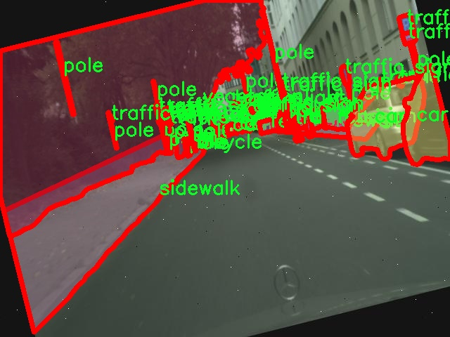

# 城市街景物体分割系统源码＆数据集分享
 [yolov8-seg-C2f-DySnakeConv＆yolov8-seg-aux等50+全套改进创新点发刊_一键训练教程_Web前端展示]

### 1.研究背景与意义

项目参考[ILSVRC ImageNet Large Scale Visual Recognition Challenge](https://gitee.com/YOLOv8_YOLOv11_Segmentation_Studio/projects)

项目来源[AAAI Global Al lnnovation Contest](https://kdocs.cn/l/cszuIiCKVNis)

研究背景与意义

随着城市化进程的加快，城市街景的复杂性和多样性日益增加，如何有效地对城市街景中的物体进行识别与分割，成为了计算机视觉领域的重要研究课题。物体分割技术不仅在自动驾驶、智能监控、城市规划等应用中具有广泛的前景，同时也为智能交通系统的构建提供了基础支持。YOLO（You Only Look Once）系列模型因其高效的实时检测能力，逐渐成为物体检测领域的主流方法。特别是YOLOv8作为该系列的最新版本，结合了深度学习的最新进展，展现出更为优越的性能。然而，面对城市街景中复杂的物体分布和遮挡情况，YOLOv8在物体分割任务中的表现仍有提升空间。

本研究旨在基于改进的YOLOv8模型，构建一个高效的城市街景物体分割系统。为此，我们将利用“cityscape-small”数据集，该数据集包含3500张城市街景图像，涵盖17个类别的物体，包括自行车、公交车、汽车、围栏、摩托车、行人、杆子、骑行者、人行道、交通灯、交通标志、卡车和植被等。这些类别不仅代表了城市交通系统中的关键元素，也反映了城市环境的多样性和复杂性。通过对这些物体的精确分割，能够为后续的城市管理、交通监控及环境保护等提供数据支持。

在研究过程中，我们将重点关注如何通过改进YOLOv8的网络结构和训练策略，提升其在城市街景物体分割任务中的表现。具体而言，我们将探索多尺度特征融合、注意力机制的引入以及数据增强技术的应用，以提高模型对不同类别物体的分割精度和鲁棒性。此外，针对城市街景中常见的遮挡和重叠现象，我们将设计相应的损失函数，增强模型对复杂场景的适应能力。

本研究的意义不仅在于提升YOLOv8在物体分割任务中的性能，更在于推动城市智能化管理的发展。通过构建高效的物体分割系统，我们能够为城市交通流量分析、公共安全监控、环境保护等领域提供更为精准的数据支持。同时，该系统的成功应用也将为相关技术的推广和普及奠定基础，促进智能城市的建设。

综上所述，基于改进YOLOv8的城市街景物体分割系统的研究，不仅具有重要的学术价值，也在实际应用中展现出广泛的前景。通过对城市街景中物体的精确识别与分割，我们能够为城市的可持续发展提供更为科学的决策依据，推动智能交通和城市管理的创新与发展。

### 2.图片演示


##### 注意：由于此博客编辑较早，上面“2.图片演示”和“3.视频演示”展示的系统图片或者视频可能为老版本，新版本在老版本的基础上升级如下：（实际效果以升级的新版本为准）

  （1）适配了YOLOV8的“目标检测”模型和“实例分割”模型，通过加载相应的权重（.pt）文件即可自适应加载模型。

  （2）支持“图片识别”、“视频识别”、“摄像头实时识别”三种识别模式。

  （3）支持“图片识别”、“视频识别”、“摄像头实时识别”三种识别结果保存导出，解决手动导出（容易卡顿出现爆内存）存在的问题，识别完自动保存结果并导出到tempDir中。

  （4）支持Web前端系统中的标题、背景图等自定义修改，后面提供修改教程。

  另外本项目提供训练的数据集和训练教程,暂不提供权重文件（best.pt）,需要您按照教程进行训练后实现图片演示和Web前端界面演示的效果。

### 3.视频演示

[3.1 视频演示](https://www.bilibili.com/video/BV1io2tYhEiY/)

### 4.数据集信息展示

##### 4.1 本项目数据集详细数据（类别数＆类别名）

nc: 17
names: ['bicycle', 'bus', 'car', 'caravan', 'fence', 'guard rail', 'motorcycle', 'object', 'person', 'pole', 'polegroup', 'rider', 'sidewalk', 'traffic light', 'traffic sign', 'truck', 'vegetation']


##### 4.2 本项目数据集信息介绍

数据集信息展示

在本研究中，我们采用了名为“cityscape-small”的数据集，以支持改进YOLOv8-seg的城市街景物体分割系统的训练与验证。该数据集专注于城市环境中的物体识别与分割，涵盖了多种常见的城市交通和生活场景，极大地丰富了模型的训练数据，提升了其在实际应用中的表现。数据集的类别数量为17，具体类别包括：自行车（bicycle）、公交车（bus）、小汽车（car）、拖车（caravan）、围栏（fence）、护栏（guard rail）、摩托车（motorcycle）、物体（object）、行人（person）、电线杆（pole）、电线杆组（polegroup）、骑行者（rider）、人行道（sidewalk）、交通灯（traffic light）、交通标志（traffic sign）、卡车（truck）以及植被（vegetation）。

“cityscape-small”数据集的设计旨在反映真实城市环境中的多样性和复杂性。每个类别的物体在图像中都有其独特的特征和背景，数据集中的图像不仅包含了不同种类的物体，还展现了不同的光照条件、天气变化以及视角变化。这种多样性使得数据集在训练深度学习模型时，能够有效提高模型的泛化能力，确保其在面对未见过的场景时，依然能够保持较高的识别精度。

在数据集的构建过程中，研究者们对每个类别的物体进行了精确的标注，确保了数据的高质量和可靠性。这种细致的标注工作不仅包括物体的边界框，还涵盖了物体的像素级分割信息，为YOLOv8-seg模型的训练提供了丰富的监督信号。通过对每个类别的物体进行精确的分割，模型能够学习到不同物体之间的边界特征，从而在实际应用中实现更为精确的物体分割。

此外，数据集的规模和样本数量也为模型的训练提供了充足的样本支持。虽然“cityscape-small”相较于其他大型数据集可能在样本数量上有所限制，但其专注于城市街景的特性，使得每个样本都具有较高的代表性。通过对这些样本的有效利用，YOLOv8-seg模型能够在特定的城市环境中，快速适应并提升其物体分割的性能。

总之，“cityscape-small”数据集为改进YOLOv8-seg的城市街景物体分割系统提供了坚实的基础。其丰富的类别信息、精确的标注和多样的场景设置，确保了模型在训练过程中能够获得充分的学习信号，进而提升其在实际应用中的表现。随着城市化进程的加快，城市街景物体分割技术的应用前景广阔，而“cityscape-small”数据集无疑是推动这一领域发展的重要资源。通过对该数据集的深入研究与应用，我们期待能够在城市智能交通、自动驾驶等领域取得更为显著的成果。




### 5.全套项目环境部署视频教程（零基础手把手教学）

[5.1 环境部署教程链接（零基础手把手教学）](https://www.bilibili.com/video/BV1jG4Ve4E9t/?vd_source=bc9aec86d164b67a7004b996143742dc)


[5.2 安装Python虚拟环境创建和依赖库安装视频教程链接（零基础手把手教学）](https://www.bilibili.com/video/BV1nA4VeYEze/?vd_source=bc9aec86d164b67a7004b996143742dc)

### 6.手把手YOLOV8-seg训练视频教程（零基础小白有手就能学会）

[6.1 手把手YOLOV8-seg训练视频教程（零基础小白有手就能学会）](https://www.bilibili.com/video/BV1cA4VeYETe/?vd_source=bc9aec86d164b67a7004b996143742dc)


按照上面的训练视频教程链接加载项目提供的数据集，运行train.py即可开始训练



     Epoch   gpu_mem       box       obj       cls    labels  img_size
     1/200     0G   0.01576   0.01955  0.007536        22      1280: 100%|██████████| 849/849 [14:42<00:00,  1.04s/it]
               Class     Images     Labels          P          R     mAP@.5 mAP@.5:.95: 100%|██████████| 213/213 [01:14<00:00,  2.87it/s]
                 all       3395      17314      0.994      0.957      0.0957      0.0843

     Epoch   gpu_mem       box       obj       cls    labels  img_size
     2/200     0G   0.01578   0.01923  0.007006        22      1280: 100%|██████████| 849/849 [14:44<00:00,  1.04s/it]
               Class     Images     Labels          P          R     mAP@.5 mAP@.5:.95: 100%|██████████| 213/213 [01:12<00:00,  2.95it/s]
                 all       3395      17314      0.996      0.956      0.0957      0.0845

     Epoch   gpu_mem       box       obj       cls    labels  img_size
     3/200     0G   0.01561    0.0191  0.006895        27      1280: 100%|██████████| 849/849 [10:56<00:00,  1.29it/s]
               Class     Images     Labels          P          R     mAP@.5 mAP@.5:.95: 100%|███████   | 187/213 [00:52<00:00,  4.04it/s]
                 all       3395      17314      0.996      0.957      0.0957      0.0845


### 7.50+种全套YOLOV8-seg创新点代码加载调参视频教程（一键加载写好的改进模型的配置文件）

[7.1 50+种全套YOLOV8-seg创新点代码加载调参视频教程（一键加载写好的改进模型的配置文件）](https://www.bilibili.com/video/BV1Hw4VePEXv/?vd_source=bc9aec86d164b67a7004b996143742dc)

### 8.YOLOV8-seg图像分割算法原理

原始YOLOv8-seg算法原理

YOLOv8-seg算法是YOLO系列最新的目标检测与分割算法，建立在YOLOv5和YOLOv7的基础上，融入了许多新的设计理念和技术改进。该算法的架构主要由输入层、主干网络、特征融合层和解耦头组成。YOLOv8-seg不仅延续了YOLO系列的高效性和准确性，还在处理图像分割任务时展现了更强的能力。

在YOLOv8-seg的设计中，主干网络采用了CSPDarknet的思想，这一结构的核心在于其轻量化设计和高效的特征提取能力。YOLOv8将YOLOv5中的C3模块替换为C2f模块，后者通过引入ELAN思想，增强了特征的流动性和表达能力。C2f模块通过多个分支的连接和融合，使得网络能够在不同层次上提取更加丰富的特征信息，从而有效地缓解了深层网络中的梯度消失问题。C2f模块由多个CBS（卷积+归一化+SiLU激活）构成，通过卷积操作提取目标的纹理和颜色特征，同时通过归一化技术解决反向传播过程中的梯度问题，提升了网络的收敛速度和效果。

特征融合层采用了PAN-FPN结构，旨在充分融合多尺度特征信息。YOLOv8在特征融合的过程中，摒弃了YOLOv5中的1x1卷积操作，直接将高层特征进行上采样，并与中层特征进行拼接，形成了一个更为紧凑和高效的特征图。这种设计使得网络能够更好地结合不同层次的语义信息，提升了对目标的检测和分割能力。

在目标检测的实现上，YOLOv8-seg采用了Anchor-Free的设计理念，抛弃了传统的Anchor-Base方法。这一转变使得模型在处理目标时不再依赖于预设的锚框，从而简化了模型的复杂性，并加速了推理过程。YOLOv8-seg通过Task-Aligned的样本匹配策略，动态地选择正样本和负样本，使得模型在训练过程中能够更好地适应不同的目标特征。

损失函数的设计上，YOLOv8-seg引入了VFLLoss作为分类损失，并结合DFLLoss和CIoULoss来提升回归精度。这种多重损失函数的组合，使得模型在处理复杂场景时，能够更准确地进行目标的分类和定位。尤其是在处理小目标和难以识别的样本时，Focal Loss的引入有效地缓解了样本不平衡的问题，提升了模型的整体性能。

在YOLOv8-seg的头部网络设计中，采用了解耦头结构，将分类和回归任务分开处理。这样一来，模型能够在分类和定位上进行更为独立的优化，从而提升了检测的精度和速度。头部网络输出的特征图通过Softmax和卷积操作，最终生成目标的边界框和类别信息。

为了提升模型的实时性和适应性，YOLOv8-seg还在数据预处理阶段引入了多种数据增强技术，包括马赛克增强、混合增强、空间扰动和颜色扰动等。这些增强手段不仅丰富了训练数据，还提高了模型对不同场景的适应能力，使得YOLOv8-seg在各种应用场景中都能表现出色。

综上所述，YOLOv8-seg算法通过引入先进的网络结构和损失函数设计，结合高效的特征融合和动态样本匹配策略，展现了在目标检测和分割任务中的优越性能。其在精度和速度上的显著提升，使得YOLOv8-seg成为了当前目标检测领域的一个重要进展，适用于智能监控、自动驾驶、医疗影像分析等多个应用场景。通过不断的技术迭代和优化，YOLOv8-seg不仅延续了YOLO系列的传统优势，还为未来的研究和应用提供了新的可能性。


### 9.系统功能展示（检测对象为举例，实际内容以本项目数据集为准）

图9.1.系统支持检测结果表格显示

  图9.2.系统支持置信度和IOU阈值手动调节

  图9.3.系统支持自定义加载权重文件best.pt(需要你通过步骤5中训练获得)

  图9.4.系统支持摄像头实时识别

  图9.5.系统支持图片识别

  图9.6.系统支持视频识别

  图9.7.系统支持识别结果文件自动保存

  图9.8.系统支持Excel导出检测结果数据


### 10.50+种全套YOLOV8-seg创新点原理讲解（非科班也可以轻松写刊发刊，V11版本正在科研待更新）

#### 10.1 由于篇幅限制，每个创新点的具体原理讲解就不一一展开，具体见下列网址中的创新点对应子项目的技术原理博客网址【Blog】：


[10.1 50+种全套YOLOV8-seg创新点原理讲解链接](https://gitee.com/qunmasj/good)

#### 10.2 部分改进模块原理讲解(完整的改进原理见上图和技术博客链接)【如果此小节的图加载失败可以通过CSDN或者Github搜索该博客的标题访问原始博客，原始博客图片显示正常】

### YOLOv8简介
YOLOv8是一种目标检测模型，是基于YOLO (You Only Look Once)系列算法发展而来的最新版本。它的核心思想是将目标检测任务转化为一个回归问题，通过单次前向传播即可直接预测出图像中的多个目标的位置和类别。
YOLOv8的网络结构采用了Darknet作为其主干网络，主要由卷积层和池化层构成。与之前的版本相比，YOLOv8在网络结构上进行了改进，引入了更多的卷积层和残差模块，以提高模型的准确性和鲁棒性。
YOLOv8采用了一种特征金字塔网络(Feature Pyramid Network,FPN)的结构，通过在不同层级上融合多尺度的特征信息，可以对不同尺度的目标进行有效的检测。此外，YOLOv8还引入了一种自适应感知域(Adaptive Anchors
的机制，通过自适应地学习目标的尺度和
长宽比，提高了模型对于不同尺度和形状目标的检测效果。
总体来说，YOLOv8结构模型综合了多个先进的目标检测技术，在保证检测速度的同时提升了检测精度和鲁棒性，被广泛应用于实时目标检测任务中。


#### yolov8网络模型结构图

YOLOv8 (You Only Look Once version 8)是一种目标检测算法，它在实时场景下可以快速准确地检测图像中的目标。
YOLOv8的网络模型结构基于Darknet框架，由一系列卷积层、池化层和全连接层组成。主要包含以下几个组件:
1.输入层:接收输入图像。
2.卷积层:使用不同尺寸的卷积核来提取图像特征。
3.残差块(Residual blocks):通过使用跳跃连接(skip connections）来解决梯度消失问题，使得网络更容易训练。
4.上采样层(Upsample layers):通过插值操作将特征图的尺寸放大，以便在不同尺度上进行目标检测。
5.池化层:用于减小特征图的尺寸，同时保留重要的特征。
6.1x1卷积层:用于降低通道数，减少网络参数量。
7.3x3卷积层:用于进—步提取和组合特征。
8.全连接层:用于最后的目标分类和定位。
YOLOv8的网络结构采用了多个不同尺度的特征图来检测不同大小的目标，从而提高了目标检测的准确性和多尺度性能。
请注意，YOLOv8网络模型结构图的具体细节可能因YOLO版本和实现方式而有所不同。


#### yolov8模型结构
YOLOv8模型是一种目标检测模型，其结构是基于YOLOv3模型进行改进的。模型结构可以分为主干网络和检测头两个部分。
主干网络是一种由Darknet-53构成的卷积神经网络。Darknet-53是一个经过多层卷积和残差连接构建起来的深度神经网络。它能够提取图像的特征信息，并将这些信息传递给检测头。
检测头是YOLOv8的关键部分，它负责在图像中定位和识别目标。检测头由一系列卷积层和全连接层组成。在每个检测头中，会生成一组锚框，并针对每个锚框预测目标的类别和位置信息。
YOLOv8模型使用了预训练的权重，其中在COCO数据集上进行了训练。这意味着该模型已经通过大规模数据集的学习，具有一定的目标检测能力。

### RT-DETR骨干网络HGNetv2简介
#### RT-DETR横空出世
前几天被百度的RT-DETR刷屏，参考该博客提出的目标检测新范式对原始DETR的网络结构进行了调整和优化，以提高计算速度和减小模型大小。这包括使用更轻量级的基础网络和调整Transformer结构。并且，摒弃了nms处理的detr结构与传统的物体检测方法相比，不仅训练是端到端的，检测也能端到端，这意味着整个网络在训练过程中一起进行优化，推理过程不需要昂贵的后处理代价，这有助于提高模型的泛化能力和性能。


当然，人们对RT-DETR之所以产生浓厚的兴趣，我觉得大概率还是对YOLO系列审美疲劳了，就算是出到了YOLO10086，我还是只想用YOLOv5和YOLOv7的框架来魔改做业务。。

#### 初识HGNet
看到RT-DETR的性能指标，发现指标最好的两个模型backbone都是用的HGNetv2，毫无疑问，和当时的picodet一样，骨干都是使用百度自家的网络。初识HGNet的时候，当时是参加了第四届百度网盘图像处理大赛，文档图像方向识别专题赛道，简单来说，就是使用分类网络对一些文档截图或者图片进行方向角度分类。


当时的方案并没有那么快定型，通常是打榜过程发现哪个网络性能好就使用哪个网络做魔改，而且木有显卡，只能蹭Ai Studio的平台，不过v100一天8小时的实验时间有点短，这也注定了大模型用不了。 

流水的模型，铁打的炼丹人，最后发现HGNet-tiny各方面指标都很符合我们的预期，后面就一直围绕它魔改。当然，比赛打榜是目的，学习才是享受过程，当时看到效果还可以，便开始折腾起了HGNet的网络架构，我们可以看到，PP-HGNet 针对 GPU 设备，对目前 GPU 友好的网络做了分析和归纳，尽可能多的使用 3x3 标准卷积（计算密度最高），PP-HGNet是由多个HG-Block组成，细节如下：


ConvBNAct是啥？简单聊一聊，就是Conv+BN+Act，CV Man应该最熟悉不过了：
```python
class ConvBNAct(TheseusLayer):
    def __init__(self,
                 in_channels,
                 out_channels,
                 kernel_size,
                 stride,
                 groups=1,
                 use_act=True):
        super().__init__()
        self.use_act = use_act
        self.conv = Conv2D(
            in_channels,
            out_channels,
            kernel_size,
            stride,
            padding=(kernel_size - 1) // 2,
            groups=groups,
            bias_attr=False)
        self.bn = BatchNorm2D(
            out_channels,
            weight_attr=ParamAttr(regularizer=L2Decay(0.0)),
            bias_attr=ParamAttr(regularizer=L2Decay(0.0)))
        if self.use_act:
            self.act = ReLU()
 
    def forward(self, x):
        x = self.conv(x)
        x = self.bn(x)
        if self.use_act:
            x = self.act(x)
        return x 
```
且标准卷积的数量随层数深度增加而增多，从而得到一个有利于 GPU 推理的骨干网络，同样速度下，精度也超越其他 CNN ，性价比也优于ViT-base模型。


另外，我们可以看到：

PP-HGNet 的第一层由channel为96的Stem模块构成，目的是为了减少参数量和计算量。PP-HGNet

Tiny的整体结构由四个HG Stage构成，而每个HG Stage主要由包含大量标准卷积的HG Block构成。

PP-HGNet的第三到第五层使用了使用了可学习的下采样层（LDS Layer），该层group为输入通道数，可达到降参降计算量的作用，且Tiny模型仅包含三个LDS Layer，并不会对GPU的利用率造成较大影响.

PP-HGNet的激活函数为Relu，常数级操作可保证该模型在硬件上的推理速度。

### 11.项目核心源码讲解（再也不用担心看不懂代码逻辑）

#### 11.1 ultralytics\nn\extra_modules\ops_dcnv3\functions\dcnv3_func.py

以下是经过简化和注释的核心代码部分，主要保留了 `DCNv3Function` 类及其前向和反向传播的实现，以及一些辅助函数。注释详细解释了每个部分的功能和作用。

```python
# --------------------------------------------------------
# InternImage
# Copyright (c) 2022 OpenGVLab
# Licensed under The MIT License [see LICENSE for details]
# --------------------------------------------------------

import torch
import torch.nn.functional as F
from torch.autograd import Function
from torch.autograd.function import once_differentiable
from torch.cuda.amp import custom_bwd, custom_fwd

# 定义DCNv3的自定义函数
class DCNv3Function(Function):
    @staticmethod
    @custom_fwd
    def forward(ctx, input, offset, mask,
                kernel_h, kernel_w, stride_h, stride_w,
                pad_h, pad_w, dilation_h, dilation_w,
                group, group_channels, offset_scale, im2col_step, remove_center):
        # 保存前向传播所需的参数
        ctx.kernel_h = kernel_h
        ctx.kernel_w = kernel_w
        ctx.stride_h = stride_h
        ctx.stride_w = stride_w
        ctx.pad_h = pad_h
        ctx.pad_w = pad_w
        ctx.dilation_h = dilation_h
        ctx.dilation_w = dilation_w
        ctx.group = group
        ctx.group_channels = group_channels
        ctx.offset_scale = offset_scale
        ctx.im2col_step = im2col_step
        ctx.remove_center = remove_center

        # 调用DCNv3的前向函数
        output = DCNv3.dcnv3_forward(input, offset, mask, kernel_h,
                                      kernel_w, stride_h, stride_w, pad_h,
                                      pad_w, dilation_h, dilation_w, group,
                                      group_channels, offset_scale, ctx.im2col_step)
        ctx.save_for_backward(input, offset, mask)  # 保存输入以备反向传播使用

        return output

    @staticmethod
    @once_differentiable
    @custom_bwd
    def backward(ctx, grad_output):
        # 从上下文中恢复保存的张量
        input, offset, mask = ctx.saved_tensors

        # 调用DCNv3的反向函数
        grad_input, grad_offset, grad_mask = DCNv3.dcnv3_backward(
            input, offset, mask, ctx.kernel_h,
            ctx.kernel_w, ctx.stride_h, ctx.stride_w, ctx.pad_h,
            ctx.pad_w, ctx.dilation_h, ctx.dilation_w, ctx.group,
            ctx.group_channels, ctx.offset_scale, grad_output.contiguous(), ctx.im2col_step
        )

        return grad_input, grad_offset, grad_mask, None, None, None, None, None, None, None, None, None, None, None, None, None

# 辅助函数：获取参考点
def _get_reference_points(spatial_shapes, device, kernel_h, kernel_w, dilation_h, dilation_w, pad_h=0, pad_w=0, stride_h=1, stride_w=1):
    _, H_, W_, _ = spatial_shapes
    # 计算输出的高度和宽度
    H_out = (H_ - (dilation_h * (kernel_h - 1) + 1)) // stride_h + 1
    W_out = (W_ - (dilation_w * (kernel_w - 1) + 1)) // stride_w + 1

    # 生成参考点的网格
    ref_y, ref_x = torch.meshgrid(
        torch.linspace((dilation_h * (kernel_h - 1)) // 2 + 0.5,
                       (dilation_h * (kernel_h - 1)) // 2 + 0.5 + (H_out - 1) * stride_h,
                       H_out, dtype=torch.float32, device=device),
        torch.linspace((dilation_w * (kernel_w - 1)) // 2 + 0.5,
                       (dilation_w * (kernel_w - 1)) // 2 + 0.5 + (W_out - 1) * stride_w,
                       W_out, dtype=torch.float32, device=device))
    )
    ref_y = ref_y.reshape(-1)[None] / H_
    ref_x = ref_x.reshape(-1)[None] / W_

    # 返回参考点
    ref = torch.stack((ref_x, ref_y), -1).reshape(1, H_out, W_out, 1, 2)
    return ref

# 辅助函数：生成膨胀网格
def _generate_dilation_grids(spatial_shapes, kernel_h, kernel_w, dilation_h, dilation_w, group, device):
    _, H_, W_, _ = spatial_shapes
    points_list = []
    x, y = torch.meshgrid(
        torch.linspace(-((dilation_w * (kernel_w - 1)) // 2),
                       -((dilation_w * (kernel_w - 1)) // 2) + (kernel_w - 1) * dilation_w,
                       kernel_w, dtype=torch.float32, device=device),
        torch.linspace(-((dilation_h * (kernel_h - 1)) // 2),
                       -((dilation_h * (kernel_h - 1)) // 2) + (kernel_h - 1) * dilation_h,
                       kernel_h, dtype=torch.float32, device=device))

    points_list.extend([x / W_, y / H_])
    grid = torch.stack(points_list, -1).reshape(-1, 1, 2).\
        repeat(1, group, 1).permute(1, 0, 2)
    grid = grid.reshape(1, 1, 1, group * kernel_h * kernel_w, 2)

    return grid

# 核心函数：DCNv3的PyTorch实现
def dcnv3_core_pytorch(input, offset, mask, kernel_h,
                       kernel_w, stride_h, stride_w, pad_h,
                       pad_w, dilation_h, dilation_w, group,
                       group_channels, offset_scale, remove_center):
    # 输入张量进行填充
    input = F.pad(input, [0, 0, pad_h, pad_h, pad_w, pad_w])
    N_, H_in, W_in, _ = input.shape
    _, H_out, W_out, _ = offset.shape

    # 获取参考点和膨胀网格
    ref = _get_reference_points(input.shape, input.device, kernel_h, kernel_w, dilation_h, dilation_w, pad_h, pad_w, stride_h, stride_w)
    grid = _generate_dilation_grids(input.shape, kernel_h, kernel_w, dilation_h, dilation_w, group, input.device)

    # 计算采样位置
    sampling_locations = (ref + grid * offset_scale).repeat(N_, 1, 1, 1, 1)
    sampling_locations = sampling_locations.flatten(3, 4)  # 展平最后两个维度

    # 使用grid_sample进行采样
    input_ = input.view(N_, H_in * W_in, group * group_channels).transpose(1, 2).reshape(N_ * group, group_channels, H_in, W_in)
    sampling_grid_ = sampling_locations.view(N_, H_out * W_out, group, -1, 2).transpose(1, 2).flatten(0, 1)
    sampling_input_ = F.grid_sample(input_, sampling_grid_, mode='bilinear', padding_mode='zeros', align_corners=False)

    # 计算输出
    mask = mask.view(N_, H_out * W_out, group, -1).transpose(1, 2).reshape(N_ * group, 1, H_out * W_out, -1)
    output = (sampling_input_ * mask).sum(-1).view(N_, group * group_channels, H_out * W_out)

    return output.transpose(1, 2).reshape(N_, H_out, W_out, -1).contiguous()
```

### 代码说明：
1. **DCNv3Function 类**：定义了一个自定义的 PyTorch 函数，包含前向传播和反向传播的实现。
   - `forward` 方法：处理输入、偏移量和掩码，调用 DCNv3 的前向函数，并保存必要的参数以供反向传播使用。
   - `backward` 方法：从上下文中恢复输入和偏移量，调用 DCNv3 的反向函数，计算梯度。

2. **辅助函数**：
   - `_get_reference_points`：生成参考点，用于计算采样位置。
   - `_generate_dilation_grids`：生成膨胀网格，用于处理不同的卷积核和膨胀参数。
   - `dcnv3_core_pytorch`：实现 DCNv3 的核心逻辑，包括输入填充、采样位置计算和最终输出的生成。

以上代码为 DCNv3 的核心实现，适用于深度学习中的可变形卷积操作。

这个文件是一个实现了DCNv3（Deformable Convolutional Networks v3）功能的PyTorch自定义操作的代码。DCNv3是一种用于提高卷积神经网络（CNN）在处理图像时的灵活性和性能的技术。该文件包含了DCNv3的前向和反向传播逻辑，以及一些辅助函数。

首先，文件导入了必要的库，包括PyTorch和一些用于自定义操作的模块。接着，它尝试导入DCNv3库，并获取其版本信息，以便在后续的操作中进行版本检查。

在DCNv3Function类中，定义了两个静态方法：`forward`和`backward`。`forward`方法实现了DCNv3的前向传播，接收输入张量、偏移量、掩码以及卷积的各种参数（如核的高度和宽度、步幅、填充、扩张等）。它将这些参数存储在上下文（ctx）中，以便在反向传播时使用。然后，它调用DCNv3库中的`dcnv3_forward`函数来执行实际的前向计算，并将输入、偏移量和掩码保存以备后续使用。

`backward`方法实现了反向传播，计算梯度。它从上下文中恢复输入、偏移量和掩码，并调用DCNv3库中的`dcnv3_backward`函数来计算输入、偏移量和掩码的梯度。返回的梯度将用于更新模型的参数。

此外，`symbolic`方法用于ONNX（Open Neural Network Exchange）导出，定义了DCNv3在ONNX图中的表示。

文件中还定义了一些辅助函数，例如`_get_reference_points`和`_generate_dilation_grids`，用于计算参考点和扩张网格。这些函数帮助生成用于采样的坐标，以便在前向传播中进行变形卷积的计算。

`remove_center_sampling_locations`函数用于在采样位置中移除中心点，以便在某些情况下（如使用奇数大小的卷积核时）进行更灵活的采样。

最后，`dcnv3_core_pytorch`函数实现了DCNv3的核心逻辑，负责处理输入、偏移量和掩码，并执行变形卷积的计算。它首先对输入进行填充，然后计算参考点和采样网格，接着使用`F.grid_sample`函数进行采样，最后将结果与掩码相乘并返回。

整体来看，这个文件实现了DCNv3的核心功能，提供了高效的变形卷积操作，能够在深度学习模型中提高特征提取的能力。

#### 11.2 ui.py


这个程序文件名为 `ui.py`，主要功能是通过当前的 Python 环境来运行一个指定的脚本，具体是一个名为 `web.py` 的文件。程序的实现过程可以分为几个主要部分。

首先，程序导入了必要的模块，包括 `sys`、`os` 和 `subprocess`。`sys` 模块用于访问与 Python 解释器相关的变量和函数，`os` 模块提供了与操作系统交互的功能，而 `subprocess` 模块则用于生成新的进程、连接到它们的输入/输出/错误管道，并获取它们的返回码。此外，程序还从 `QtFusion.path` 模块中导入了 `abs_path` 函数，用于获取文件的绝对路径。

接下来，定义了一个名为 `run_script` 的函数，该函数接受一个参数 `script_path`，表示要运行的脚本的路径。在函数内部，首先获取当前 Python 解释器的路径，这通过 `sys.executable` 实现。然后，构建一个命令字符串，该命令使用当前的 Python 解释器和 `streamlit` 模块来运行指定的脚本。具体的命令格式为 `"{python_path}" -m streamlit run "{script_path}"`。

之后，使用 `subprocess.run` 方法执行构建好的命令。该方法的 `shell=True` 参数表示在一个新的 shell 中执行命令。执行完命令后，程序检查返回码，如果返回码不为 0，说明脚本运行过程中出现了错误，此时会打印出一条错误信息。

最后，在 `if __name__ == "__main__":` 语句块中，程序指定了要运行的脚本路径，这里使用 `abs_path("web.py")` 来获取 `web.py` 的绝对路径。然后调用 `run_script` 函数来执行这个脚本。

总的来说，这个程序的主要目的是通过命令行启动一个 Streamlit 应用，方便用户在当前的 Python 环境中运行指定的脚本。

#### 11.2 ultralytics\solutions\ai_gym.py

以下是代码中最核心的部分，并附上详细的中文注释：

```python
import cv2
from ultralytics.utils.plotting import Annotator

class AIGym:
    """用于管理基于姿势的实时视频流中人们的健身动作的类。"""

    def __init__(self):
        """初始化 AIGym，设置视觉和图像参数的默认值。"""
        self.im0 = None  # 当前帧图像
        self.tf = None   # 线条厚度

        # 关键点和计数信息
        self.keypoints = None  # 姿势关键点
        self.poseup_angle = None  # 上升姿势的角度
        self.posedown_angle = None  # 下降姿势的角度
        self.threshold = 0.001  # 阈值

        # 存储阶段、计数和角度信息
        self.angle = None  # 姿势角度
        self.count = None  # 动作计数
        self.stage = None  # 当前阶段
        self.pose_type = 'pushup'  # 姿势类型（默认为俯卧撑）
        self.kpts_to_check = None  # 需要检查的关键点

        # 视觉信息
        self.view_img = False  # 是否显示图像
        self.annotator = None  # 注释器实例

    def set_args(self, kpts_to_check, line_thickness=2, view_img=False, pose_up_angle=145.0, pose_down_angle=90.0, pose_type='pullup'):
        """
        配置 AIGym 的参数
        Args:
            kpts_to_check (list): 用于计数的 3 个关键点
            line_thickness (int): 边界框的线条厚度
            view_img (bool): 是否显示图像
            pose_up_angle (float): 设置上升姿势的角度
            pose_down_angle (float): 设置下降姿势的角度
            pose_type: "pushup", "pullup" 或 "abworkout"
        """
        self.kpts_to_check = kpts_to_check  # 设置需要检查的关键点
        self.tf = line_thickness  # 设置线条厚度
        self.view_img = view_img  # 设置是否显示图像
        self.poseup_angle = pose_up_angle  # 设置上升姿势的角度
        self.posedown_angle = pose_down_angle  # 设置下降姿势的角度
        self.pose_type = pose_type  # 设置姿势类型

    def start_counting(self, im0, results, frame_count):
        """
        计数健身动作的函数
        Args:
            im0 (ndarray): 当前视频流的帧
            results: 姿势估计数据
            frame_count: 当前帧计数
        """
        self.im0 = im0  # 更新当前帧图像
        if frame_count == 1:
            # 初始化计数、角度和阶段
            self.count = [0] * len(results[0])  # 初始化计数
            self.angle = [0] * len(results[0])  # 初始化角度
            self.stage = ['-' for _ in results[0]]  # 初始化阶段

        self.keypoints = results[0].keypoints.data  # 获取关键点数据
        self.annotator = Annotator(im0, line_width=2)  # 创建注释器实例

        # 遍历每个关键点
        for ind, k in enumerate(reversed(self.keypoints)):
            # 计算姿势角度
            self.angle[ind] = self.annotator.estimate_pose_angle(
                k[int(self.kpts_to_check[0])].cpu(),
                k[int(self.kpts_to_check[1])].cpu(),
                k[int(self.kpts_to_check[2])].cpu()
            )
            # 绘制关键点
            self.im0 = self.annotator.draw_specific_points(k, self.kpts_to_check, shape=(640, 640), radius=10)

            # 根据姿势类型更新阶段和计数
            if self.pose_type == 'pushup':
                if self.angle[ind] > self.poseup_angle:
                    self.stage[ind] = 'up'
                if self.angle[ind] < self.posedown_angle and self.stage[ind] == 'up':
                    self.stage[ind] = 'down'
                    self.count[ind] += 1

            elif self.pose_type == 'pullup':
                if self.angle[ind] > self.poseup_angle:
                    self.stage[ind] = 'down'
                if self.angle[ind] < self.posedown_angle and self.stage[ind] == 'down':
                    self.stage[ind] = 'up'
                    self.count[ind] += 1

            # 绘制角度、计数和阶段信息
            self.annotator.plot_angle_and_count_and_stage(
                angle_text=self.angle[ind],
                count_text=self.count[ind],
                stage_text=self.stage[ind],
                center_kpt=k[int(self.kpts_to_check[1])],
                line_thickness=self.tf
            )

            # 绘制所有关键点
            self.annotator.kpts(k, shape=(640, 640), radius=1, kpt_line=True)

        # 如果需要显示图像，则展示当前帧
        if self.view_img:
            cv2.imshow('Ultralytics YOLOv8 AI GYM', self.im0)
            if cv2.waitKey(1) & 0xFF == ord('q'):
                return

if __name__ == '__main__':
    AIGym()  # 创建 AIGym 实例
```

### 代码核心部分说明：
1. **类的初始化**：`__init__` 方法中定义了多个用于存储图像、关键点、计数、角度和阶段等信息的属性。
2. **参数设置**：`set_args` 方法用于配置关键点、线条厚度、是否显示图像、姿势的上下角度以及姿势类型。
3. **计数逻辑**：`start_counting` 方法是核心功能，负责根据姿势估计结果更新关键点、计算角度、判断阶段并进行计数，同时使用 `Annotator` 绘制图像和文本信息。

这个程序文件定义了一个名为 `AIGym` 的类，主要用于在实时视频流中基于人体姿态来管理健身动作的计数。程序的核心功能是通过分析视频流中的人体关键点，来识别和计数特定的健身动作（如俯卧撑、引体向上和腹部锻炼）。

在类的初始化方法 `__init__` 中，定义了一些用于存储图像、关键点、角度、计数和状态信息的变量。这些变量包括图像数据 `im0`、线条厚度 `tf`、关键点 `keypoints`、上下姿态角度 `poseup_angle` 和 `posedown_angle`、计数 `count`、阶段 `stage` 以及当前的姿态类型 `pose_type`。此外，还有一个用于可视化的标志 `view_img` 和一个注释器 `annotator`。

`set_args` 方法用于配置一些参数，包括需要检查的关键点、线条厚度、是否显示图像、上下姿态的角度以及姿态类型。这个方法允许用户根据不同的健身动作需求来调整参数。

`start_counting` 方法是计数的核心功能。它接收当前帧图像 `im0`、姿态估计结果 `results` 和当前帧计数 `frame_count`。在第一次调用时，会初始化计数、角度和阶段信息。接着，程序会遍历每个人体的关键点，计算姿态角度，并根据不同的姿态类型（如俯卧撑、引体向上和腹部锻炼）来判断当前的运动阶段（上或下），并相应地更新计数。

在每个姿态的判断中，程序会使用 `annotator` 对象来绘制关键点、角度、计数和阶段信息。最后，如果 `view_img` 为真，程序会使用 OpenCV 显示当前图像，并在按下 'q' 键时退出显示。

在文件的最后部分，程序通过 `if __name__ == '__main__':` 来实例化 `AIGym` 类，表明这个文件可以作为一个独立的脚本运行。整体来看，这个程序为实时健身动作的监测和计数提供了一个有效的解决方案。

#### 11.3 ultralytics\data\base.py

以下是经过简化和注释的核心代码部分，保留了关键功能并提供了详细的中文注释：

```python
import glob
import os
import random
from copy import deepcopy
from pathlib import Path
import cv2
import numpy as np
from torch.utils.data import Dataset

class BaseDataset(Dataset):
    """
    基础数据集类，用于加载和处理图像数据。

    参数:
        img_path (str): 图像文件夹的路径。
        imgsz (int, optional): 图像大小，默认为640。
        augment (bool, optional): 是否应用数据增强，默认为True。
        classes (list): 包含的类别列表，默认为None。
        fraction (float): 使用的数据集比例，默认为1.0（使用所有数据）。
    """

    def __init__(self, img_path, imgsz=640, augment=True, classes=None, fraction=1.0):
        """初始化BaseDataset，配置和选项。"""
        super().__init__()
        self.img_path = img_path  # 图像路径
        self.imgsz = imgsz  # 图像大小
        self.augment = augment  # 是否进行数据增强
        self.im_files = self.get_img_files(self.img_path)  # 获取图像文件列表
        self.labels = self.get_labels()  # 获取标签数据
        self.update_labels(include_class=classes)  # 更新标签以包含指定类别
        self.ni = len(self.labels)  # 数据集中图像的数量

    def get_img_files(self, img_path):
        """读取图像文件。"""
        f = []  # 存储图像文件
        # 遍历给定路径，获取所有图像文件
        for p in img_path if isinstance(img_path, list) else [img_path]:
            p = Path(p)  # 处理路径
            if p.is_dir():  # 如果是目录
                f += glob.glob(str(p / '**' / '*.*'), recursive=True)  # 获取所有图像文件
            elif p.is_file():  # 如果是文件
                with open(p) as t:
                    t = t.read().strip().splitlines()  # 读取文件内容
                    parent = str(p.parent) + os.sep
                    f += [x.replace('./', parent) if x.startswith('./') else x for x in t]  # 替换路径
            else:
                raise FileNotFoundError(f'{p} 不存在')
        # 过滤出有效的图像文件
        im_files = sorted(x for x in f if x.split('.')[-1].lower() in ['jpg', 'jpeg', 'png'])
        assert im_files, f'没有在 {img_path} 中找到图像'
        if self.fraction < 1:
            im_files = im_files[:round(len(im_files) * self.fraction)]  # 根据比例返回图像文件
        return im_files

    def update_labels(self, include_class):
        """更新标签以仅包含指定类别（可选）。"""
        for i in range(len(self.labels)):
            if include_class is not None:
                cls = self.labels[i]['cls']
                # 过滤标签，只保留指定类别
                j = np.isin(cls, include_class)
                self.labels[i]['cls'] = cls[j]
                self.labels[i]['bboxes'] = self.labels[i]['bboxes'][j]

    def load_image(self, i):
        """加载数据集中索引为 'i' 的图像，返回图像及其原始和调整后的尺寸。"""
        im = cv2.imread(self.im_files[i])  # 读取图像
        if im is None:
            raise FileNotFoundError(f'未找到图像 {self.im_files[i]}')
        # 调整图像大小
        im = cv2.resize(im, (self.imgsz, self.imgsz), interpolation=cv2.INTER_LINEAR)
        return im

    def __getitem__(self, index):
        """返回给定索引的图像和标签信息。"""
        label = deepcopy(self.labels[index])  # 深拷贝标签
        label['img'] = self.load_image(index)  # 加载图像
        return label  # 返回图像和标签

    def __len__(self):
        """返回数据集中标签的数量。"""
        return len(self.labels)

    def get_labels(self):
        """用户可以自定义标签格式。"""
        raise NotImplementedError  # 需要用户实现
```

### 代码注释说明：
1. **类和方法文档**：每个类和方法都有详细的文档字符串，描述其功能和参数。
2. **图像文件读取**：`get_img_files` 方法负责读取指定路径下的所有图像文件，并进行格式过滤。
3. **标签更新**：`update_labels` 方法根据用户指定的类别更新标签信息。
4. **图像加载**：`load_image` 方法用于加载图像并调整其大小。
5. **数据集长度**：`__len__` 方法返回数据集中标签的数量，便于在训练过程中使用。

通过这种方式，代码的核心功能得以保留，同时提供了清晰的中文注释，便于理解和维护。

这个程序文件是一个用于加载和处理图像数据的基础数据集类，名为 `BaseDataset`，它是从 PyTorch 的 `Dataset` 类继承而来的。该类主要用于计算机视觉任务，特别是与 YOLO（You Only Look Once）目标检测模型相关的任务。

在初始化方法 `__init__` 中，类接收多个参数，包括图像路径、图像大小、是否缓存图像、数据增强选项、超参数、批处理大小等。初始化过程中，类会读取图像文件、获取标签信息，并根据需要更新标签以仅包含指定的类别。它还会根据参数设置缓存图像到内存或磁盘，并构建图像变换函数。

`get_img_files` 方法用于读取指定路径下的图像文件。它支持传入文件夹路径或文件列表，并会根据图像格式过滤有效的图像文件。如果指定的路径无效，则会抛出异常。该方法还支持根据给定的比例来限制使用的数据集大小。

`update_labels` 方法用于更新标签信息，以便仅包含指定的类别。它会根据输入的类别列表过滤标签，并在单类训练模式下将所有类别标记为同一类。

`load_image` 方法用于加载指定索引的图像，并根据需要进行调整大小。它会根据原始图像的大小和所需的图像大小进行比例缩放，并在训练时将图像存入缓冲区以便于数据增强。

`cache_images` 和 `cache_images_to_disk` 方法用于将图像缓存到内存或磁盘，以提高后续加载的速度。`check_cache_ram` 方法则用于检查可用内存是否足够缓存图像。

`set_rectangle` 方法用于设置 YOLO 检测的边界框形状为矩形，主要用于处理不同长宽比的图像，以便于训练时的批处理。

`__getitem__` 方法返回给定索引的图像和标签信息，并应用预定义的变换。`get_image_and_label` 方法则用于获取图像和对应的标签信息，并计算图像的缩放比例。

`__len__` 方法返回数据集中标签的数量。`update_labels_info` 方法允许用户自定义标签格式。

`build_transforms` 和 `get_labels` 方法是留给用户自定义的，前者用于定义数据增强的具体操作，后者用于定义标签的读取格式。总的来说，这个类为图像数据的加载、处理和增强提供了一个灵活的基础框架，适用于 YOLO 等目标检测模型的训练。

#### 11.4 train.py

以下是代码中最核心的部分，并附上详细的中文注释：

```python
import os
import torch
import yaml
from ultralytics import YOLO  # 导入YOLO模型库

if __name__ == '__main__':  # 确保该模块被直接运行时才执行以下代码
    # 设置训练参数
    workers = 1  # 数据加载的工作进程数
    batch = 8  # 每个批次的样本数量
    device = "0" if torch.cuda.is_available() else "cpu"  # 判断是否使用GPU

    # 获取数据集配置文件的绝对路径
    data_path = abs_path(f'datasets/data/data.yaml', path_type='current')

    # 将路径转换为Unix风格
    unix_style_path = data_path.replace(os.sep, '/')
    # 获取目录路径
    directory_path = os.path.dirname(unix_style_path)

    # 读取YAML文件，保持原有顺序
    with open(data_path, 'r') as file:
        data = yaml.load(file, Loader=yaml.FullLoader)

    # 修改数据集中训练、验证和测试的路径
    if 'train' in data and 'val' in data and 'test' in data:
        data['train'] = directory_path + '/train'  # 设置训练数据路径
        data['val'] = directory_path + '/val'      # 设置验证数据路径
        data['test'] = directory_path + '/test'    # 设置测试数据路径

        # 将修改后的数据写回YAML文件
        with open(data_path, 'w') as file:
            yaml.safe_dump(data, file, sort_keys=False)

    # 加载YOLO模型配置文件和预训练权重
    model = YOLO(r"C:\codeseg\codenew\50+种YOLOv8算法改进源码大全和调试加载训练教程（非必要）\改进YOLOv8模型配置文件\yolov8-seg-C2f-Faster.yaml").load("./weights/yolov8s-seg.pt")

    # 开始训练模型
    results = model.train(
        data=data_path,  # 指定训练数据的配置文件路径
        device=device,  # 指定使用的设备（GPU或CPU）
        workers=workers,  # 指定数据加载的工作进程数
        imgsz=640,  # 指定输入图像的大小为640x640
        epochs=100,  # 指定训练的轮数为100
        batch=batch,  # 指定每个批次的样本数量
    )
```

### 代码核心部分解释：
1. **导入库**：导入必要的库，包括操作系统库、PyTorch、YAML解析库和YOLO模型库。
2. **参数设置**：设置数据加载的工作进程数、批次大小和设备（GPU或CPU）。
3. **数据路径处理**：获取数据集配置文件的绝对路径，并将其转换为Unix风格路径，以便于后续处理。
4. **读取和修改YAML文件**：读取YAML文件，修改训练、验证和测试数据的路径，并将修改后的内容写回文件。
5. **加载YOLO模型**：加载YOLO模型的配置文件和预训练权重。
6. **模型训练**：调用模型的训练方法，传入数据路径、设备、工作进程数、图像大小、训练轮数和批次大小等参数，开始训练模型。

该程序文件 `train.py` 是一个用于训练 YOLO（You Only Look Once）模型的脚本。首先，它导入了必要的库，包括操作系统库 `os`、深度学习框架 `torch`、YAML 处理库 `yaml` 以及 YOLO 模型库 `ultralytics`。此外，还导入了 `QtFusion.path` 中的 `abs_path` 函数来处理路径，并设置了 Matplotlib 的后端为 `TkAgg`。

在主程序部分，首先设置了一些训练参数，包括工作进程数 `workers` 和批次大小 `batch`。批次大小可以根据计算机的显存和内存进行调整，以避免显存溢出。接着，程序检测是否有可用的 GPU，如果有，则将设备设置为 GPU（"0"），否则使用 CPU。

接下来，程序构建了数据集配置文件的绝对路径，读取 YAML 文件以获取数据集的相关信息。程序确保 YAML 文件中包含训练、验证和测试数据的路径，并将这些路径修改为当前目录下的相应子目录。修改后的数据会被写回到 YAML 文件中。

在模型加载部分，程序使用指定的 YOLO 配置文件加载预训练的 YOLOv8 模型。这里提供了一个路径，指向 YOLOv8 的配置文件和权重文件。用户可以根据需要选择不同的模型配置文件。

最后，程序调用 `model.train()` 方法开始训练模型。训练过程中指定了数据配置文件路径、设备、工作进程数、输入图像大小（640x640）、训练的 epoch 数（100）以及批次大小。训练结果将被存储在 `results` 变量中。

整体来看，该脚本实现了 YOLO 模型的训练流程，包括数据路径的设置、模型的加载和训练参数的配置，适合于计算机视觉任务中的目标检测和分割。

#### 11.5 ultralytics\trackers\bot_sort.py

以下是代码中最核心的部分，并附上详细的中文注释：

```python
class BOTrack(STrack):
    """
    BOTrack类是STrack类的扩展，增加了目标跟踪功能。
    """

    shared_kalman = KalmanFilterXYWH()  # 所有BOTrack实例共享的卡尔曼滤波器

    def __init__(self, tlwh, score, cls, feat=None, feat_history=50):
        """初始化BOTrack实例，设置初始参数和特征历史记录。"""
        super().__init__(tlwh, score, cls)  # 调用父类构造函数

        self.smooth_feat = None  # 平滑特征向量
        self.curr_feat = None  # 当前特征向量
        if feat is not None:
            self.update_features(feat)  # 更新特征
        self.features = deque([], maxlen=feat_history)  # 存储特征向量的双端队列
        self.alpha = 0.9  # 指数移动平均的平滑因子

    def update_features(self, feat):
        """更新特征向量，并使用指数移动平均进行平滑处理。"""
        feat /= np.linalg.norm(feat)  # 归一化特征向量
        self.curr_feat = feat  # 设置当前特征
        if self.smooth_feat is None:
            self.smooth_feat = feat  # 如果平滑特征为空，则直接赋值
        else:
            # 使用指数移动平均更新平滑特征
            self.smooth_feat = self.alpha * self.smooth_feat + (1 - self.alpha) * feat
        self.features.append(feat)  # 将当前特征添加到特征队列
        self.smooth_feat /= np.linalg.norm(self.smooth_feat)  # 归一化平滑特征

    def predict(self):
        """使用卡尔曼滤波器预测目标的均值和协方差。"""
        mean_state = self.mean.copy()  # 复制当前均值状态
        if self.state != TrackState.Tracked:
            mean_state[6] = 0  # 如果状态不是跟踪状态，重置速度
            mean_state[7] = 0

        # 使用卡尔曼滤波器进行预测
        self.mean, self.covariance = self.kalman_filter.predict(mean_state, self.covariance)

    @property
    def tlwh(self):
        """获取当前目标的位置，格式为 (左上角x, 左上角y, 宽度, 高度)。"""
        if self.mean is None:
            return self._tlwh.copy()  # 如果均值为空，返回原始tlwh
        ret = self.mean[:4].copy()  # 复制均值的前四个元素
        ret[:2] -= ret[2:] / 2  # 计算左上角坐标
        return ret

    @staticmethod
    def multi_predict(stracks):
        """使用共享的卡尔曼滤波器预测多个目标的均值和协方差。"""
        if len(stracks) <= 0:
            return  # 如果没有目标，直接返回
        multi_mean = np.asarray([st.mean.copy() for st in stracks])  # 获取所有目标的均值
        multi_covariance = np.asarray([st.covariance for st in stracks])  # 获取所有目标的协方差
        for i, st in enumerate(stracks):
            if st.state != TrackState.Tracked:
                multi_mean[i][6] = 0  # 如果状态不是跟踪状态，重置速度
                multi_mean[i][7] = 0
        # 使用共享的卡尔曼滤波器进行多目标预测
        multi_mean, multi_covariance = BOTrack.shared_kalman.multi_predict(multi_mean, multi_covariance)
        for i, (mean, cov) in enumerate(zip(multi_mean, multi_covariance)):
            stracks[i].mean = mean  # 更新每个目标的均值
            stracks[i].covariance = cov  # 更新每个目标的协方差
```

### 代码核心部分解释：
1. **BOTrack类**：继承自STrack类，增加了特征更新和卡尔曼滤波器预测的功能。
2. **共享卡尔曼滤波器**：所有BOTrack实例共享一个卡尔曼滤波器，便于多目标跟踪。
3. **特征更新**：通过`update_features`方法更新当前特征并进行平滑处理，使用指数移动平均来减少噪声。
4. **预测功能**：`predict`方法使用卡尔曼滤波器预测目标的状态，更新均值和协方差。
5. **坐标转换**：通过`tlwh`属性获取目标的位置信息，格式为左上角坐标和宽高。

这些功能使得BOTrack能够有效地进行目标跟踪，并在特征更新和状态预测方面提供了支持。

这个程序文件 `bot_sort.py` 是用于对象跟踪的实现，特别是与 YOLOv8 目标检测模型结合使用的 BoT-SORT 跟踪器。该文件主要包含两个类：`BOTrack` 和 `BOTSORT`，它们分别负责单个对象的跟踪和整体的跟踪管理。

`BOTrack` 类是对 `STrack` 类的扩展，增加了对象跟踪的功能。它使用卡尔曼滤波器来预测对象的位置，并维护一个特征向量的历史记录。该类的主要属性包括共享的卡尔曼滤波器、平滑的特征向量、当前特征向量以及用于存储特征向量的双端队列。`update_features` 方法用于更新特征向量并使用指数移动平均进行平滑处理。`predict` 方法利用卡尔曼滤波器预测对象的状态。`re_activate` 和 `update` 方法用于重新激活和更新跟踪对象的状态。`tlwh` 属性提供了当前对象的位置，以左上角坐标和宽高的格式表示。`multi_predict` 方法可以对多个对象的状态进行预测，而 `convert_coords` 和 `tlwh_to_xywh` 方法则用于坐标格式的转换。

`BOTSORT` 类是对 `BYTETracker` 类的扩展，旨在实现基于 ReID（重识别）和 GMC（全局运动一致性）算法的对象跟踪。它的构造函数初始化了一些跟踪参数，包括空间接近度和外观相似度的阈值。`get_kalmanfilter` 方法返回一个卡尔曼滤波器的实例。`init_track` 方法用于根据检测结果初始化跟踪，支持使用 ReID 模块提取特征。`get_dists` 方法计算跟踪对象与检测对象之间的距离，结合了 IoU 和 ReID 特征的相似度。`multi_predict` 方法则用于同时预测多个对象的状态。

整体而言，这个文件实现了一个高效的对象跟踪系统，能够在动态场景中跟踪多个对象，并利用深度学习模型进行特征提取和相似度计算。

#### 11.6 ultralytics\nn\modules\transformer.py

以下是代码中最核心的部分，并附上详细的中文注释：

```python
import torch
import torch.nn as nn
import torch.nn.functional as F

class TransformerEncoderLayer(nn.Module):
    """定义一个单层的Transformer编码器。"""

    def __init__(self, c1, cm=2048, num_heads=8, dropout=0.0, act=nn.GELU(), normalize_before=False):
        """初始化TransformerEncoderLayer，设置参数。"""
        super().__init__()
        self.ma = nn.MultiheadAttention(c1, num_heads, dropout=dropout, batch_first=True)  # 多头自注意力机制
        self.fc1 = nn.Linear(c1, cm)  # 前馈网络的第一层
        self.fc2 = nn.Linear(cm, c1)  # 前馈网络的第二层
        self.norm1 = nn.LayerNorm(c1)  # 第一层归一化
        self.norm2 = nn.LayerNorm(c1)  # 第二层归一化
        self.dropout = nn.Dropout(dropout)  # dropout层
        self.dropout1 = nn.Dropout(dropout)  # 第一个dropout层
        self.dropout2 = nn.Dropout(dropout)  # 第二个dropout层
        self.act = act  # 激活函数
        self.normalize_before = normalize_before  # 是否在前向传播前进行归一化

    def forward(self, src, src_mask=None, src_key_padding_mask=None, pos=None):
        """通过编码器模块进行前向传播。"""
        if self.normalize_before:
            return self.forward_pre(src, src_mask, src_key_padding_mask, pos)
        return self.forward_post(src, src_mask, src_key_padding_mask, pos)

    def forward_post(self, src, src_mask=None, src_key_padding_mask=None, pos=None):
        """后归一化的前向传播。"""
        q = k = self.with_pos_embed(src, pos)  # 计算查询和键
        src2 = self.ma(q, k, value=src, attn_mask=src_mask, key_padding_mask=src_key_padding_mask)[0]  # 自注意力计算
        src = src + self.dropout1(src2)  # 残差连接
        src = self.norm1(src)  # 归一化
        src2 = self.fc2(self.dropout(self.act(self.fc1(src))))  # 前馈网络
        src = src + self.dropout2(src2)  # 残差连接
        return self.norm2(src)  # 归一化

    @staticmethod
    def with_pos_embed(tensor, pos=None):
        """如果提供了位置嵌入，则将其添加到张量中。"""
        return tensor if pos is None else tensor + pos


class AIFI(TransformerEncoderLayer):
    """定义AIFI变换器层。"""

    def forward(self, x):
        """AIFI变换器层的前向传播。"""
        c, h, w = x.shape[1:]  # 获取输入的通道、高度和宽度
        pos_embed = self.build_2d_sincos_position_embedding(w, h, c)  # 构建2D位置嵌入
        x = super().forward(x.flatten(2).permute(0, 2, 1), pos=pos_embed.to(device=x.device, dtype=x.dtype))  # 调用父类的前向传播
        return x.permute(0, 2, 1).view([-1, c, h, w]).contiguous()  # 还原形状

    @staticmethod
    def build_2d_sincos_position_embedding(w, h, embed_dim=256, temperature=10000.0):
        """构建2D正弦余弦位置嵌入。"""
        grid_w = torch.arange(int(w), dtype=torch.float32)  # 水平网格
        grid_h = torch.arange(int(h), dtype=torch.float32)  # 垂直网格
        grid_w, grid_h = torch.meshgrid(grid_w, grid_h, indexing='ij')  # 创建网格
        pos_dim = embed_dim // 4  # 位置维度
        omega = torch.arange(pos_dim, dtype=torch.float32) / pos_dim  # 计算频率
        omega = 1. / (temperature ** omega)  # 温度缩放

        out_w = grid_w.flatten()[..., None] @ omega[None]  # 水平位置嵌入
        out_h = grid_h.flatten()[..., None] @ omega[None]  # 垂直位置嵌入

        return torch.cat([torch.sin(out_w), torch.cos(out_w), torch.sin(out_h), torch.cos(out_h)], 1)[None]  # 返回位置嵌入


class TransformerLayer(nn.Module):
    """Transformer层，使用线性变换和多头注意力机制。"""

    def __init__(self, c, num_heads):
        """初始化自注意力机制。"""
        super().__init__()
        self.q = nn.Linear(c, c, bias=False)  # 查询线性变换
        self.k = nn.Linear(c, c, bias=False)  # 键线性变换
        self.v = nn.Linear(c, c, bias=False)  # 值线性变换
        self.ma = nn.MultiheadAttention(embed_dim=c, num_heads=num_heads)  # 多头自注意力机制
        self.fc1 = nn.Linear(c, c, bias=False)  # 前馈网络的第一层
        self.fc2 = nn.Linear(c, c, bias=False)  # 前馈网络的第二层

    def forward(self, x):
        """应用Transformer块并返回输出。"""
        x = self.ma(self.q(x), self.k(x), self.v(x))[0] + x  # 自注意力计算和残差连接
        return self.fc2(self.fc1(x)) + x  # 前馈网络和残差连接


class MLPBlock(nn.Module):
    """实现一个多层感知机的单个块。"""

    def __init__(self, embedding_dim, mlp_dim, act=nn.GELU):
        """初始化MLPBlock。"""
        super().__init__()
        self.lin1 = nn.Linear(embedding_dim, mlp_dim)  # 第一层线性变换
        self.lin2 = nn.Linear(mlp_dim, embedding_dim)  # 第二层线性变换
        self.act = act()  # 激活函数

    def forward(self, x: torch.Tensor) -> torch.Tensor:
        """MLPBlock的前向传播。"""
        return self.lin2(self.act(self.lin1(x)))  # 前向传播


class MLP(nn.Module):
    """实现一个简单的多层感知机（也称为FFN）。"""

    def __init__(self, input_dim, hidden_dim, output_dim, num_layers):
        """初始化MLP。"""
        super().__init__()
        self.num_layers = num_layers
        h = [hidden_dim] * (num_layers - 1)  # 隐藏层维度
        self.layers = nn.ModuleList(nn.Linear(n, k) for n, k in zip([input_dim] + h, h + [output_dim]))  # 创建层

    def forward(self, x):
        """整个MLP的前向传播。"""
        for i, layer in enumerate(self.layers):
            x = F.relu(layer(x)) if i < self.num_layers - 1 else layer(x)  # 激活函数应用
        return x  # 返回输出
```

### 代码核心部分说明
1. **TransformerEncoderLayer**: 实现了Transformer编码器的单层，包含多头自注意力机制和前馈网络。
2. **AIFI**: 继承自`TransformerEncoderLayer`，增加了2D位置嵌入的构建。
3. **TransformerLayer**: 实现了一个基本的Transformer层，包含自注意力和前馈网络。
4. **MLPBlock**: 实现了一个多层感知机的基本结构。
5. **MLP**: 实现了一个简单的多层感知机，支持多层结构。

这些类是构建Transformer模型的基础，提供了自注意力机制和前馈网络的实现，适用于各种深度学习任务。

这个程序文件定义了一系列与Transformer相关的模块，主要用于计算机视觉任务中的特征提取和处理。文件中包含多个类，每个类实现了不同的功能。

首先，`TransformerEncoderLayer`类定义了Transformer编码器的单层结构。它使用多头自注意力机制（`nn.MultiheadAttention`）来处理输入特征，并通过前馈神经网络（两个线性层）进行进一步的特征变换。该类支持前置和后置归一化的两种前向传播方式，用户可以根据需要选择使用。

接下来，`AIFI`类是`TransformerEncoderLayer`的一个扩展，专门用于处理二维输入数据。它在前向传播中构建了二维的正弦余弦位置嵌入，并将输入数据展平以适应Transformer的输入格式。

`TransformerLayer`类实现了一个简化的Transformer层，去除了层归一化，以提高性能。它同样使用多头自注意力机制和前馈网络。

`TransformerBlock`类则将多个`TransformerLayer`组合在一起，形成一个完整的Transformer模块。它还包含可选的卷积层，用于调整输入和输出的通道数。

`MLPBlock`和`MLP`类实现了多层感知机（MLP），用于特征的非线性变换。`MLPBlock`定义了一个单独的MLP块，而`MLP`则实现了一个完整的多层感知机，支持多个层次的堆叠。

`LayerNorm2d`类实现了二维层归一化，用于对输入的每个通道进行归一化处理，以提高模型的稳定性和收敛速度。

`MSDeformAttn`类实现了多尺度可变形注意力机制，允许模型在不同尺度上自适应地选择关注的区域。这对于处理不同尺寸的输入特征非常重要。

`DeformableTransformerDecoderLayer`和`DeformableTransformerDecoder`类实现了可变形Transformer解码器。解码器层包含自注意力和交叉注意力机制，能够有效地处理输入特征并生成输出。

整体而言，这个文件提供了一整套用于实现Transformer架构的模块，适用于各种计算机视觉任务，尤其是在目标检测和图像分割等领域。每个模块都经过精心设计，以确保在处理复杂数据时能够有效地提取和转换特征。

### 12.系统整体结构（节选）

### 整体功能和架构概括

该项目是一个基于YOLO（You Only Look Once）目标检测模型的计算机视觉框架，提供了多种功能模块，包括数据处理、模型训练、对象跟踪、Transformer结构实现等。整体架构分为以下几个主要部分：

1. **数据处理**：通过 `base.py` 提供的数据集类，支持图像的加载、预处理和增强，为模型训练提供合适的数据输入。

2. **模型训练**：`train.py` 脚本负责训练YOLO模型，设置训练参数，加载数据集，并启动训练过程。

3. **对象跟踪**：`bot_sort.py` 实现了BoT-SORT跟踪器，结合ReID特征和卡尔曼滤波器进行多对象跟踪。

4. **Transformer模块**：`transformer.py` 提供了Transformer相关的模块，支持特征提取和处理，适用于各种计算机视觉任务。

5. **用户界面**：`ui.py` 提供了一个简单的用户界面，用于启动和运行特定的脚本（如Web应用）。

6. **健身动作识别**：`ai_gym.py` 实现了一个基于姿态估计的健身动作计数系统。

7. **模型推理**：其他模块（如 `predict.py` 和 `val.py`）提供了模型推理和验证的功能。

### 文件功能整理表

| 文件路径                                                    | 功能描述                                                         |
|-----------------------------------------------------------|------------------------------------------------------------------|
| `ultralytics\nn\extra_modules\ops_dcnv3\functions\dcnv3_func.py` | 实现DCNv3（Deformable Convolutional Networks v3）功能，支持前向和反向传播。 |
| `ui.py`                                                  | 提供用户界面，允许通过命令行启动指定的脚本（如Web应用）。        |
| `ultralytics\solutions\ai_gym.py`                       | 实现基于姿态估计的健身动作计数系统，实时监测和计数健身动作。     |
| `ultralytics\data\base.py`                              | 定义数据集类，负责图像的加载、预处理和增强，为模型训练提供数据。 |
| `train.py`                                              | 负责训练YOLO模型，设置训练参数，加载数据集并启动训练过程。     |
| `ultralytics\trackers\bot_sort.py`                     | 实现BoT-SORT对象跟踪器，结合ReID特征和卡尔曼滤波器进行多对象跟踪。 |
| `ultralytics\nn\modules\transformer.py`                | 提供Transformer相关模块，支持特征提取和处理，适用于计算机视觉任务。 |
| `ultralytics\models\nas\val.py`                        | 实现模型验证功能，评估模型在验证集上的性能。                     |
| `model.py`                                             | 定义YOLO模型结构，负责模型的构建和配置。                        |
| `ultralytics\utils\callbacks\tensorboard.py`           | 集成TensorBoard回调，用于训练过程中的可视化和监控。             |
| `ultralytics\nn\modules\block.py`                      | 定义网络中的基本模块（如卷积块、激活函数等），用于构建模型。    |
| `ultralytics\models\fastsam\predict.py`                | 实现快速推理功能，支持模型在输入数据上的快速预测。              |
| `ultralytics\nn\backbone\revcol.py`                    | 定义网络的主干结构，可能涉及特征提取的卷积层和其他基础组件。    |

以上表格总结了每个文件的主要功能，展示了该项目的模块化设计和各个部分之间的协作关系。

注意：由于此博客编辑较早，上面“11.项目核心源码讲解（再也不用担心看不懂代码逻辑）”中部分代码可能会优化升级，仅供参考学习，完整“训练源码”、“Web前端界面”和“50+种创新点源码”以“14.完整训练+Web前端界面+50+种创新点源码、数据集获取”的内容为准。

### 13.图片、视频、摄像头图像分割Demo(去除WebUI)代码

在这个博客小节中，我们将讨论如何在不使用WebUI的情况下，实现图像分割模型的使用。本项目代码已经优化整合，方便用户将分割功能嵌入自己的项目中。
核心功能包括图片、视频、摄像头图像的分割，ROI区域的轮廓提取、类别分类、周长计算、面积计算、圆度计算以及颜色提取等。
这些功能提供了良好的二次开发基础。

### 核心代码解读

以下是主要代码片段，我们会为每一块代码进行详细的批注解释：

```python
import random
import cv2
import numpy as np
from PIL import ImageFont, ImageDraw, Image
from hashlib import md5
from model import Web_Detector
from chinese_name_list import Label_list

# 根据名称生成颜色
def generate_color_based_on_name(name):
    ......

# 计算多边形面积
def calculate_polygon_area(points):
    return cv2.contourArea(points.astype(np.float32))

...
# 绘制中文标签
def draw_with_chinese(image, text, position, font_size=20, color=(255, 0, 0)):
    image_pil = Image.fromarray(cv2.cvtColor(image, cv2.COLOR_BGR2RGB))
    draw = ImageDraw.Draw(image_pil)
    font = ImageFont.truetype("simsun.ttc", font_size, encoding="unic")
    draw.text(position, text, font=font, fill=color)
    return cv2.cvtColor(np.array(image_pil), cv2.COLOR_RGB2BGR)

# 动态调整参数
def adjust_parameter(image_size, base_size=1000):
    max_size = max(image_size)
    return max_size / base_size

# 绘制检测结果
def draw_detections(image, info, alpha=0.2):
    name, bbox, conf, cls_id, mask = info['class_name'], info['bbox'], info['score'], info['class_id'], info['mask']
    adjust_param = adjust_parameter(image.shape[:2])
    spacing = int(20 * adjust_param)

    if mask is None:
        x1, y1, x2, y2 = bbox
        aim_frame_area = (x2 - x1) * (y2 - y1)
        cv2.rectangle(image, (x1, y1), (x2, y2), color=(0, 0, 255), thickness=int(3 * adjust_param))
        image = draw_with_chinese(image, name, (x1, y1 - int(30 * adjust_param)), font_size=int(35 * adjust_param))
        y_offset = int(50 * adjust_param)  # 类别名称上方绘制，其下方留出空间
    else:
        mask_points = np.concatenate(mask)
        aim_frame_area = calculate_polygon_area(mask_points)
        mask_color = generate_color_based_on_name(name)
        try:
            overlay = image.copy()
            cv2.fillPoly(overlay, [mask_points.astype(np.int32)], mask_color)
            image = cv2.addWeighted(overlay, 0.3, image, 0.7, 0)
            cv2.drawContours(image, [mask_points.astype(np.int32)], -1, (0, 0, 255), thickness=int(8 * adjust_param))

            # 计算面积、周长、圆度
            area = cv2.contourArea(mask_points.astype(np.int32))
            perimeter = cv2.arcLength(mask_points.astype(np.int32), True)
            ......

            # 计算色彩
            mask = np.zeros(image.shape[:2], dtype=np.uint8)
            cv2.drawContours(mask, [mask_points.astype(np.int32)], -1, 255, -1)
            color_points = cv2.findNonZero(mask)
            ......

            # 绘制类别名称
            x, y = np.min(mask_points, axis=0).astype(int)
            image = draw_with_chinese(image, name, (x, y - int(30 * adjust_param)), font_size=int(35 * adjust_param))
            y_offset = int(50 * adjust_param)

            # 绘制面积、周长、圆度和色彩值
            metrics = [("Area", area), ("Perimeter", perimeter), ("Circularity", circularity), ("Color", color_str)]
            for idx, (metric_name, metric_value) in enumerate(metrics):
                ......

    return image, aim_frame_area

# 处理每帧图像
def process_frame(model, image):
    pre_img = model.preprocess(image)
    pred = model.predict(pre_img)
    det = pred[0] if det is not None and len(det)
    if det:
        det_info = model.postprocess(pred)
        for info in det_info:
            image, _ = draw_detections(image, info)
    return image

if __name__ == "__main__":
    cls_name = Label_list
    model = Web_Detector()
    model.load_model("./weights/yolov8s-seg.pt")

    # 摄像头实时处理
    cap = cv2.VideoCapture(0)
    while cap.isOpened():
        ret, frame = cap.read()
        if not ret:
            break
        ......

    # 图片处理
    image_path = './icon/OIP.jpg'
    image = cv2.imread(image_path)
    if image is not None:
        processed_image = process_frame(model, image)
        ......

    # 视频处理
    video_path = ''  # 输入视频的路径
    cap = cv2.VideoCapture(video_path)
    while cap.isOpened():
        ret, frame = cap.read()
        ......
```


### 14.完整训练+Web前端界面+50+种创新点源码、数据集获取


# [下载链接：https://mbd.pub/o/bread/Zpybk55s](https://mbd.pub/o/bread/Zpybk55s)